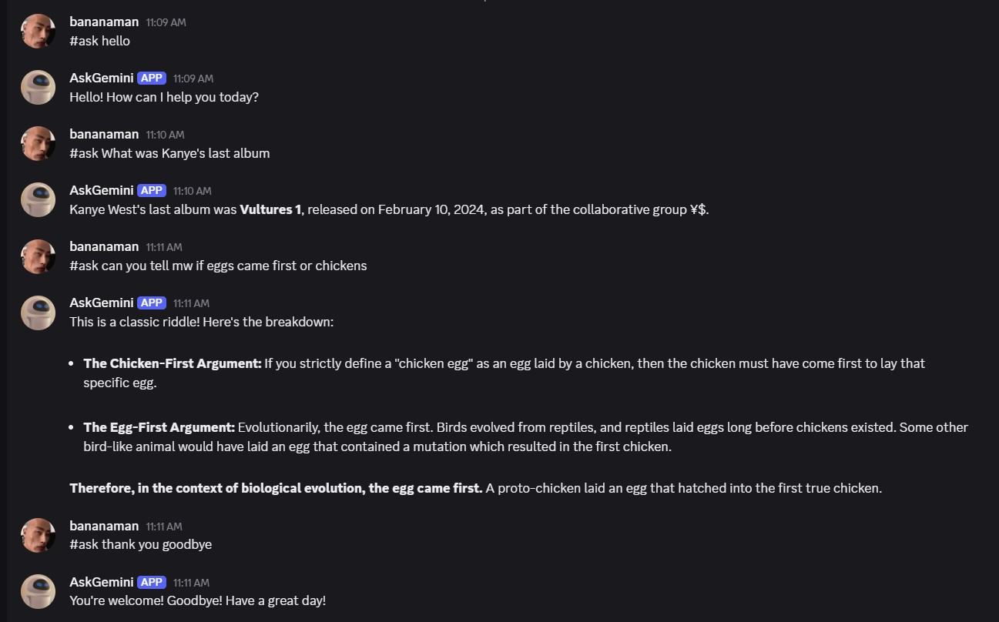

# AskGemini
This is a discord bot uses the Gemini 2.5 API to fetch answers to user prompts sent in any discord server that the bot is in. This is a small and fun project that uses the discord.js library and Google's Gemini API.
 
The link for the bot is given below:  
https://discord.com/oauth2/authorize?client_id=1376461737200713778&permissions=274877925376&integration_type=0&scope=bot

Use #ask with your questions, to prompt Gemini for a response.

